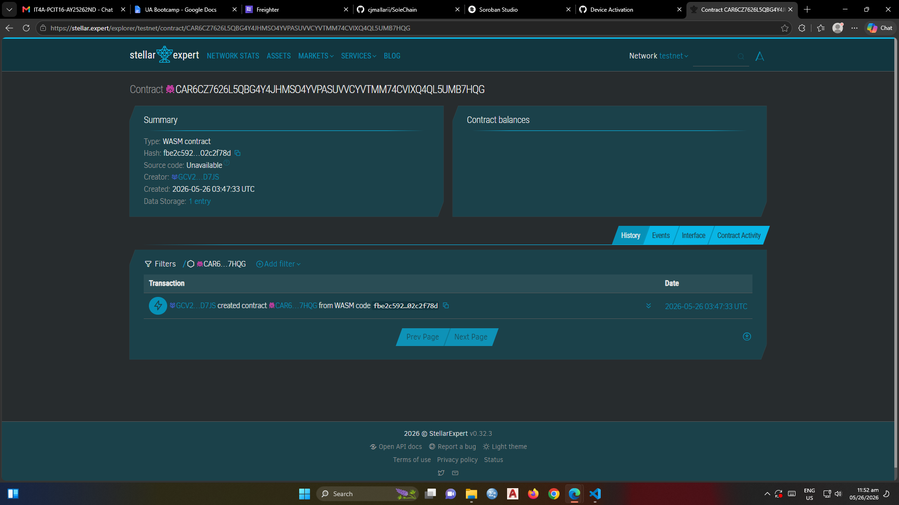

# SoleChain

On-chain sneaker ownership certificates — verify authenticity and full provenance in under 3 seconds.

## Problem

Sneaker resellers in Metro Manila and Jakarta lose millions annually buying counterfeit limited-edition pairs from peer-to-peer platforms with no way to verify authenticity or ownership history.

## Solution

SoleChain issues a Soroban-backed ownership token at the point of manufacture. Buyers scan an NFC chip; the app calls `transfer_ownership` on-chain. Every previous owner, sale date, and recall status is publicly verifiable — forever.

## Timeline

| Phase | Scope |
|---|---|
| Day 1–2 | Contract + testnet deploy |
| Day 3–4 | Frontend NFC scan + Stellar wallet connect |
| Day 5 | Demo polish + pitch |

## Stellar features used

- Soroban smart contracts (ownership state, clawback logic)
- XLM (transaction fees)
- Custom token model (one token per shoe pair, via contract)
- Trustlines (buyer must accept the shoe asset before receiving)
- Clawback / Compliance (manufacturer recall capability)

## Vision and purpose

SoleChain makes physical ownership as trustworthy as on-chain ownership — bridging the real-world sneaker economy with verifiable digital provenance. Long-term: any luxury physical good can use this model.

## Prerequisites

- Rust 1.74+
- Soroban CLI 21.x (`cargo install --locked soroban-cli`)
- Stellar Testnet account with funded XLM

## Build

```bash
soroban contract build
```

Output: `target/wasm32-unknown-unknown/release/sole_chain.wasm`

## Test

```bash
cargo test
```

## Deploy to testnet

```bash
soroban contract deploy \
  --wasm target/wasm32-unknown-unknown/release/sole_chain.wasm \
  --source-account <YOUR_SECRET_KEY> \
  --network testnet
```

## Sample CLI invocations

Initialize the contract with a manufacturer address:
```bash
soroban contract invoke \
  --id <CONTRACT_ID> \
  --source <MANUFACTURER_SECRET> \
  --network testnet \
  -- initialize \
  --manufacturer GDMN...7XQZ
```

Mint a shoe:
```bash
soroban contract invoke \
  --id <CONTRACT_ID> \
  --source <MANUFACTURER_SECRET> \
  --network testnet \
  -- mint \
  --shoe_id "NK-AJ1-2024-00841" \
  --initial_owner GBXT...R4KA
```

Transfer ownership (called after NFC scan):
```bash
soroban contract invoke \
  --id <CONTRACT_ID> \
  --source <CURRENT_OWNER_SECRET> \
  --network testnet \
  -- transfer_ownership \
  --shoe_id "NK-AJ1-2024-00841" \
  --new_owner GCNZ...P9MM
```

Get current owner:
```bash
soroban contract invoke \
  --id <CONTRACT_ID> \
  --network testnet \
  -- get_owner \
  --shoe_id "NK-AJ1-2024-00841"
```
## CONTRACT_ID

CAR6CZ7626L5QBG4Y4JHMSO4YVPASUVVCYVTMM74CVIXQ4QL5UMB7HQG

## LINK

https://stellar.expert/explorer/testnet/contract/CAR6CZ7626L5QBG4Y4JHMSO4YVPASUVVCYVTMM74CVIXQ4QL5UMB7HQG

## SCREENSHOT

## License

MIT